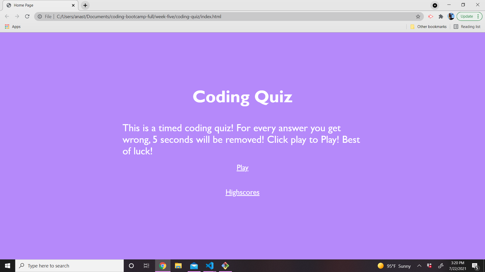

# coding-quiz
## Languages Used 
HTML, CSS and JavaScript 

## Purpose and requiremenets 
The purpose of the this was to create a timed coding quiz that was able to take in the users choice, deem it correct or incorrect and later on put the user's score on a highscores page using local storage. Methods that were used includes: arrays, loops, functions and variables. 

## Improvements 
One way that this could be improved upon would be to make all the html, style sheets and javascripts all go onto one page to make it easier. 

## Screenshot of site 
 

## Link to deployed website 
https://akerschen-coder.github.io/coding-quiz/ 